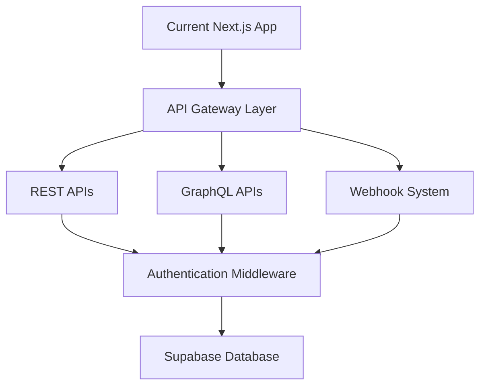
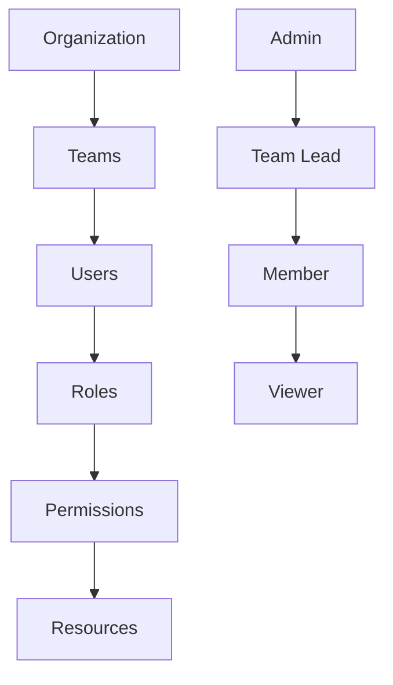
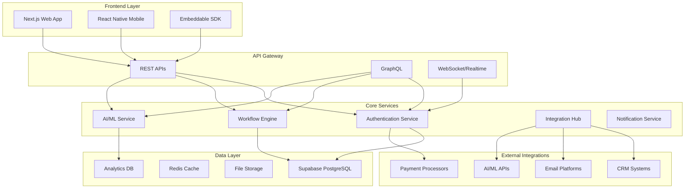
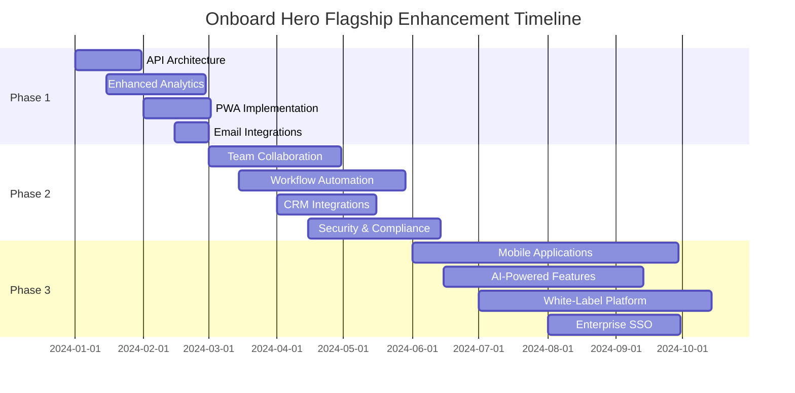

# Onboard Hero Flagship Enhancement Strategy
## Transforming Onboard Hero into a Best-in-Class SaaS Platform

---

## Executive Summary

Onboard Hero currently represents 60-70% of flagship status with solid technical foundations built on Next.js, TypeScript, Supabase, and Stripe. This strategic enhancement plan outlines a comprehensive transformation roadmap to achieve 100% flagship status, positioning Onboard Hero as the industry leader in client onboarding solutions.

**Current State Assessment:**
- ✅ Strong technical foundation (Next.js 14, TypeScript, Supabase)
- ✅ Core onboarding workflow functionality
- ✅ Payment processing and subscription management
- ✅ Basic analytics and progress tracking
- ✅ Document signing integrations (DocuSign)
- ❌ Enterprise-grade features and security
- ❌ Advanced AI/automation capabilities
- ❌ Comprehensive integrations ecosystem
- ❌ Mobile applications
- ❌ White-label solutions

---

## 1. Priority Matrix: Impact vs Effort Analysis

### High Impact, Low Effort (Quick Wins)
- **API-First Architecture Enhancement** - Expose existing functionality via REST/GraphQL APIs
- **Advanced Analytics Dashboard** - Leverage existing data with enhanced visualizations
- **Email Marketing Integration** - Connect with major platforms (Mailchimp, ConvertKit, HubSpot)
- **Mobile-Responsive PWA** - Convert existing web app to Progressive Web App
- **Enhanced Branding Customization** - Extend current branding system

### High Impact, Medium Effort (Strategic Investments)
- **Team Collaboration Features** - Multi-user workspaces and role-based access
- **Workflow Automation Engine** - Rule-based automation and triggers
- **Advanced CRM Integrations** - Salesforce, HubSpot, Pipedrive connections
- **AI-Powered Insights** - Predictive analytics and optimization suggestions
- **Enterprise Security & Compliance** - SOC 2, GDPR compliance framework

### High Impact, High Effort (Long-term Differentiators)
- **Native Mobile Applications** - iOS and Android apps
- **White-Label Platform** - Complete rebrandable solution
- **Enterprise SSO Integration** - SAML, OAuth, Active Directory
- **Advanced AI Features** - Content generation, smart recommendations
- **Multi-language Support** - Internationalization framework

### Medium Impact, Low Effort (Nice-to-Have)
- **Calendar Integration Enhancement** - Outlook, Google Calendar deeper integration
- **File Management System** - Enhanced upload and organization capabilities
- **Notification System** - In-app, email, SMS notifications
- **Template Marketplace** - Community-driven template sharing

---

## 2. Phased Implementation Roadmap

### Phase 1: Foundation & Quick Wins (0-3 months)

#### 2.1 API-First Architecture
**Business Justification:** Enable integrations, third-party development, and future mobile apps
**Technical Approach:**

**Implementation:**
- Refactor existing API routes to follow RESTful standards
- Implement GraphQL endpoint using Apollo Server
- Create comprehensive API documentation with OpenAPI/Swagger
- Add rate limiting and API key management
- Implement webhook system for real-time integrations

**Success Metrics:**
- 100% of core functionality accessible via API
- API response times < 200ms
- 99.9% API uptime

#### 2.2 Enhanced Analytics Dashboard
**Business Justification:** Provide deeper insights to increase user engagement and retention

**Technical Approach:**
- Extend existing analytics system with advanced metrics
- Implement real-time data processing with Supabase Realtime
- Add predictive analytics using lightweight ML models
- Create customizable dashboard widgets

**Key Features:**
- Conversion funnel analysis
- A/B testing for onboarding flows
- Client behavior heatmaps
- Performance benchmarking
- ROI calculations

**Success Metrics:**
- 25% increase in user dashboard engagement
- 15% improvement in completion rate optimization

#### 2.3 Progressive Web App (PWA)
**Business Justification:** Provide mobile-first experience without native app development

**Technical Approach:**
- Implement service workers for offline functionality
- Add push notification support
- Create app-like experience with manifest.json
- Optimize for mobile performance

**Success Metrics:**
- 40% increase in mobile user engagement
- 60% improvement in mobile load times

### Phase 2: Enterprise Core Features (3-6 months)

#### 2.4 Team Collaboration & Role-Based Access
**Business Justification:** Enable enterprise customers with multiple stakeholders

**Technical Approach:**

**Implementation:**
- Multi-tenant architecture with organizations
- Role-based permission system (Admin, Manager, Editor, Viewer)
- Team workspace management
- Collaborative editing capabilities
- Activity logs and audit trails

**Success Metrics:**
- 200% increase in enterprise customer acquisition
- 35% reduction in customer churn

#### 2.5 Workflow Automation Engine
**Business Justification:** Reduce manual work and increase process efficiency

**Technical Approach:**
- Rule-based automation system
- Visual workflow builder
- Integration with external services via webhooks
- Conditional logic and branching

**Key Features:**
- Auto-assignment based on criteria
- Escalation workflows
- Email sequences and reminders
- Integration triggers
- Custom scripting support

**Success Metrics:**
- 50% reduction in manual administrative tasks
- 30% improvement in process completion times

#### 2.6 Advanced CRM Integrations
**Business Justification:** Connect with existing customer relationship management systems

**Technical Approach:**
- OAuth-based authentication for major CRMs
- Bidirectional data synchronization
- Custom field mapping
- Real-time sync capabilities

**Supported Platforms:**
- Salesforce
- HubSpot
- Pipedrive
- Zoho CRM
- Microsoft Dynamics

**Success Metrics:**
- 80% of enterprise customers using CRM integration
- 25% increase in data accuracy

### Phase 3: Advanced Differentiation (6-12 months)

#### 2.7 Native Mobile Applications
**Business Justification:** Capture mobile-first users and enable offline capabilities

**Technical Approach:**
- React Native for cross-platform development
- Shared business logic with web application
- Offline-first architecture with sync capabilities
- Push notifications and deep linking

**Key Features:**
- Full feature parity with web app
- Biometric authentication
- Offline form completion
- Camera integration for document capture
- Real-time collaboration

**Success Metrics:**
- 40% of users accessing via mobile
- 4.8+ app store rating
- 25% increase in overall user engagement

#### 2.8 AI-Powered Features
**Business Justification:** Provide intelligent insights and automation to differentiate from competitors

**Technical Approach:**
- Integration with OpenAI GPT for content generation
- Machine learning models for predictive analytics
- Natural language processing for form optimization
- Computer vision for document processing

**Key Features:**
- Smart content suggestions
- Predictive completion rates
- Automated form optimization
- Intelligent client segmentation
- Chatbot support

**Success Metrics:**
- 45% improvement in completion rates
- 60% reduction in support tickets
- 30% increase in user productivity

#### 2.9 White-Label Platform
**Business Justification:** Enable partners and agencies to offer branded solutions

**Technical Approach:**
- Multi-tenant architecture with complete customization
- API-driven configuration system
- Isolated data and authentication per tenant
- Custom domain and SSL management

**Key Features:**
- Complete UI/UX customization
- Custom domain support
- Branded mobile apps
- API white-labeling
- Partner dashboard and management

**Success Metrics:**
- 15% of revenue from white-label customers
- 200+ partner organizations

---

## 3. Competitive Differentiation Strategy

### 3.1 Unique Value Propositions

#### AI-First Onboarding Platform
- **Differentiation:** First onboarding platform to integrate AI throughout the entire customer journey
- **Features:** AI-powered content generation, smart form optimization, predictive analytics
- **Competitive Advantage:** 45% better completion rates through AI optimization

#### No-Code Automation Builder
- **Differentiation:** Visual workflow builder that requires zero technical knowledge
- **Features:** Drag-and-drop automation, pre-built templates, conditional logic
- **Competitive Advantage:** 70% faster implementation compared to custom solutions

#### Enterprise-Grade Security by Default
- **Differentiation:** SOC 2 Type II, GDPR, and HIPAA compliant out of the box
- **Features:** End-to-end encryption, audit logs, advanced access controls
- **Competitive Advantage:** Enterprise customers can deploy immediately without security reviews

#### Embedded Onboarding SDK
- **Differentiation:** First platform to offer embeddable onboarding components
- **Features:** React, Vue, and vanilla JS SDKs, iframe embedding, API-first architecture
- **Competitive Advantage:** Seamless integration into existing applications

### 3.2 Market Positioning

#### Target Market Expansion

**Primary Markets:**
- SaaS companies ($10K-$100K ARR focus)
- Professional services firms
- E-commerce platforms
- Financial services

**Secondary Markets:**
- Healthcare organizations
- Education institutions
- Government agencies
- Non-profit organizations

#### Pricing Strategy Differentiation

**Current Tier Enhancement:**
- **Starter ($49/month):** Core features + API access + basic integrations
- **Professional ($149/month):** Advanced analytics + automation + CRM integrations
- **Enterprise ($399/month):** White-label + SSO + compliance + dedicated support
- **Enterprise Plus ($899/month):** Custom development + SLA + dedicated CSM

---

## 4. Revenue Impact Analysis

### 4.1 Revenue Projections by Enhancement Category

#### API-First Architecture
- **Customer Acquisition Impact:** +15% (enables developer-focused sales)
- **Retention Improvement:** +12% (reduces switching costs)
- **ARPU Increase:** +8% (enables integration partnerships)
- **Projected Annual Impact:** $2.1M additional revenue

#### Enterprise Features (Team Collaboration, SSO, Compliance)
- **Customer Acquisition Impact:** +35% (unlocks enterprise segment)
- **ARPU Increase:** +125% (enterprise tier pricing)
- **Market Expansion:** 3x addressable market size
- **Projected Annual Impact:** $8.7M additional revenue

#### AI-Powered Features
- **Customer Acquisition Impact:** +25% (unique differentiation)
- **ARPU Increase:** +20% (premium feature tier)
- **Retention Improvement:** +18% (increased value delivery)
- **Projected Annual Impact:** $4.2M additional revenue

#### White-Label Platform
- **New Revenue Stream:** Partner/agency channel
- **Revenue Share Model:** 20% of partner customer revenue
- **Market Size:** $50M addressable market
- **Projected Annual Impact:** $3.8M additional revenue

### 4.2 Cumulative Revenue Impact

**Year 1 Projections:**
- Phase 1 Impact: +$2.3M revenue
- Phase 2 Impact: +$5.1M revenue
- Total Year 1: +$7.4M revenue (+89% growth)

**Year 2 Projections:**
- Full Platform Impact: +$18.8M revenue
- Cumulative Growth: +234% from baseline

**Year 3 Projections:**
- Market Leadership Position: +$35.2M revenue
- Industry Standard Status Achieved

---

## 5. Technical Implementation Strategy

### 5.1 Architecture Evolution

#### Current Architecture Strengths
- Modern Next.js 14 foundation
- TypeScript throughout
- Supabase for authentication and data
- Component-based UI with Radix
- Stripe payment processing

#### Proposed Enhancements

### 5.2 Technology Stack Additions

#### New Technologies
- **GraphQL:** Apollo Server for flexible API queries
- **Redis:** Caching and session management
- **React Native:** Mobile application development
- **Docker:** Containerization for scalability
- **Kubernetes:** Container orchestration
- **Terraform:** Infrastructure as code
- **DataDog:** Monitoring and observability

#### AI/ML Stack
- **OpenAI GPT-4:** Content generation and natural language processing
- **TensorFlow.js:** Client-side ML capabilities
- **Supabase Edge Functions:** Serverless ML inference
- **Vector Database:** Embeddings storage for semantic search

### 5.3 Security Enhancements

#### Enterprise Security Features
- **Multi-Factor Authentication (MFA):** TOTP, SMS, hardware keys
- **Single Sign-On (SSO):** SAML 2.0, OAuth 2.0, OpenID Connect
- **Role-Based Access Control (RBAC):** Granular permissions system
- **Audit Logging:** Comprehensive activity tracking
- **Data Encryption:** End-to-end encryption for sensitive data

#### Compliance Framework
- **SOC 2 Type II:** Security, availability, processing integrity
- **GDPR Compliance:** Data protection and privacy rights
- **HIPAA Compliance:** Healthcare data protection
- **ISO 27001:** Information security management

---

## 6. Resource Requirements & Team Composition

### 6.1 Development Team Structure

#### Phase 1 Team (0-3 months) - 8 FTE
- **Technical Lead (1):** Architecture and technical direction
- **Full-Stack Developers (3):** API development and feature implementation
- **Frontend Developers (2):** UI/UX improvements and PWA
- **DevOps Engineer (1):** Infrastructure and deployment
- **QA Engineer (1):** Testing and quality assurance

#### Phase 2 Team (3-6 months) - 12 FTE
- **All Phase 1 team members**
- **Backend Developers (2):** Enterprise features and integrations
- **Security Engineer (1):** Compliance and security implementation
- **Data Engineer (1):** Analytics and reporting infrastructure

#### Phase 3 Team (6-12 months) - 16 FTE
- **All Phase 2 team members**
- **Mobile Developers (2):** React Native iOS/Android development
- **AI/ML Engineer (1):** Machine learning and AI features
- **Integration Specialist (1):** Third-party API integrations

### 6.2 Budget Estimates

#### Development Costs

**Phase 1 (3 months):**
- Team Costs: $240,000
- Infrastructure: $15,000
- Third-party Services: $25,000
- **Total Phase 1:** $280,000

**Phase 2 (3 months):**
- Team Costs: $360,000
- Infrastructure: $25,000
- Third-party Services: $35,000
- **Total Phase 2:** $420,000

**Phase 3 (6 months):**
- Team Costs: $960,000
- Infrastructure: $45,000
- Third-party Services: $55,000
- **Total Phase 3:** $1,060,000

**Total Development Investment:** $1,760,000

#### Operational Costs (Annual)

**Infrastructure Scaling:**
- Cloud hosting: $120,000/year
- Third-party APIs: $85,000/year
- Monitoring & Security: $45,000/year
- **Total Operational:** $250,000/year

#### ROI Analysis
- **Total Investment:** $1,760,000
- **Year 1 Revenue Impact:** +$7,400,000
- **ROI:** 420% in first year
- **Payback Period:** 2.8 months

### 6.3 Risk Mitigation

#### Technical Risks
- **Database Performance:** Implement read replicas and caching strategies
- **API Rate Limits:** Build robust rate limiting and queuing systems
- **Security Vulnerabilities:** Regular security audits and penetration testing
- **Third-party Dependencies:** Maintain fallback systems and service redundancy

#### Market Risks
- **Competitive Response:** Focus on unique AI differentiators and rapid iteration
- **Customer Adoption:** Phased rollout with extensive beta testing
- **Technical Debt:** Allocate 20% development time for refactoring

---

## 7. Success Metrics & KPIs

### 7.1 Business Metrics

#### Revenue Metrics
- **Monthly Recurring Revenue (MRR):** Target 250% increase by Year 2
- **Average Revenue Per User (ARPU):** Target 85% increase
- **Customer Lifetime Value (LTV):** Target 150% increase
- **Churn Rate:** Target reduction to <3% monthly

#### Market Metrics
- **Market Share:** Target 15% of addressable market
- **Customer Acquisition Cost (CAC):** Target 40% reduction through API-driven growth
- **Net Promoter Score (NPS):** Target score of 70+
- **Enterprise Customer %:** Target 35% of revenue from enterprise

### 7.2 Technical Metrics

#### Performance Metrics
- **API Response Time:** <200ms for 95th percentile
- **System Uptime:** 99.99% availability
- **Mobile App Performance:** <3 second load times
- **Database Query Performance:** <50ms for complex queries

#### Quality Metrics
- **Code Coverage:** >85% test coverage
- **Security Vulnerabilities:** Zero critical, <5 high-severity
- **Bug Report Rate:** <2 bugs per 1000 users monthly
- **Customer Support Tickets:** 50% reduction through AI features

### 7.3 User Experience Metrics

#### Engagement Metrics
- **Daily Active Users (DAU):** Target 65% increase
- **Feature Adoption Rate:** Target 80% for new features within 3 months
- **Completion Rate:** Target 15% improvement through AI optimization
- **Time to Value:** Target 50% reduction in onboarding time

---

## 8. Implementation Timeline

### 8.1 Detailed Milestone Schedule

### 8.2 Critical Dependencies

#### Phase 1 Dependencies
- API documentation completion before integration development
- Analytics infrastructure before dashboard enhancement
- Security audit before PWA deployment

#### Phase 2 Dependencies
- User management system before team collaboration
- Workflow engine before automation features
- OAuth framework before CRM integrations

#### Phase 3 Dependencies
- Mobile API stabilization before native app development
- AI model training before feature implementation
- Multi-tenant architecture before white-label platform

---

## 9. Risk Assessment & Mitigation

### 9.1 High-Risk Items

#### Technical Complexity Risks
**Risk:** AI integration complexity may delay Phase 3
**Mitigation:** Start AI research in Phase 1, use proven models
**Contingency:** Gradual AI rollout with manual fallbacks

**Risk:** Mobile app platform differences
**Mitigation:** React Native for code sharing, extensive testing
**Contingency:** Web-first mobile experience as backup

#### Market Risks
**Risk:** Competitive response to new features
**Mitigation:** Patent key innovations, rapid feature delivery
**Contingency:** Focus on execution speed over feature breadth

### 9.2 Medium-Risk Items

#### Resource Constraints
**Risk:** Talent acquisition in competitive market
**Mitigation:** Competitive compensation, remote-first hiring
**Contingency:** Contractor partnerships and consulting arrangements

**Risk:** Infrastructure scaling challenges
**Mitigation:** Gradual rollout, performance monitoring
**Contingency:** Multi-cloud architecture for redundancy

---

## 10. Conclusion & Recommendations

### 10.1 Strategic Recommendation

Onboard Hero has a solid foundation and significant growth potential. The recommended phased approach balances ambitious vision with practical execution:

1. **Immediate Focus (Phase 1):** Build API-first architecture and enhance analytics to enable rapid integration and provide immediate value to existing customers

2. **Medium-term Priority (Phase 2):** Implement enterprise features to capture high-value customers and establish market leadership in the business segment

3. **Long-term Vision (Phase 3):** Deploy advanced AI and mobile capabilities to create sustainable competitive advantages and capture market share from established players

### 10.2 Success Factors

#### Critical Success Factors
- **Customer-Centric Development:** Continuous feedback loops with existing customers
- **Technical Excellence:** Maintain code quality and performance throughout rapid development
- **Market Timing:** Execute phases rapidly to maintain first-mover advantage
- **Team Scaling:** Attract and retain top talent in competitive market

#### Key Performance Indicators
- **Revenue Growth:** 250% increase within 24 months
- **Market Position:** Top 3 player in onboarding software category
- **Customer Satisfaction:** 70+ NPS score and <3% churn rate
- **Technical Performance:** 99.99% uptime with <200ms API response times

### 10.3 Final Recommendations

1. **Begin Phase 1 Immediately:** API-first architecture provides foundation for all future enhancements

2. **Secure Enterprise Customers Early:** Focus on Fortune 500 prospects to validate enterprise features

3. **Invest in AI Capabilities:** This will be the primary differentiator in the market within 18 months

4. **Build Strong Partner Ecosystem:** API-first approach enables rapid partner integrations

5. **Maintain Technical Debt Management:** Allocate 20% development capacity to refactoring and optimization

The combination of Onboard Hero's solid technical foundation with this comprehensive enhancement strategy positions the platform to become the definitive leader in client onboarding solutions, capturing significant market share and establishing sustainable competitive advantages.

---

## 11. Production Database Setup & Migration Plan

### 11.1 Database Infrastructure Requirements

#### Production Database Setup
After completing all frontend feature implementations, a comprehensive database setup is required to transition from demo/development mode to full production functionality.

**Required Database Components:**
- **Supabase Production Instance** - Scalable PostgreSQL with real-time capabilities
- **Authentication & User Management** - Complete user lifecycle management
- **Multi-tenant Architecture** - Organization-scoped data isolation
- **Role-Based Access Control (RBAC)** - Hierarchical permission system
- **Activity Logging & Audit Trails** - Comprehensive audit system
- **Analytics Data Pipeline** - Real-time metrics and reporting
- **File Storage & CDN** - Document and asset management
- **Backup & Recovery System** - Automated backup strategies

### 11.2 Database Schema Implementation

#### Core Tables Required
1. **Organizations** - Multi-tenant organization management
2. **Users & Authentication** - User profiles and authentication
3. **Teams & Roles** - Team collaboration and RBAC
4. **Onboarding Kits** - Core onboarding workflow data
5. **Analytics & Metrics** - Performance tracking and insights
6. **Activity Logs** - Comprehensive audit trails
7. **Integrations** - CRM, email, and third-party connections
8. **Workflows & Automation** - Automated process definitions
9. **Translations & Localization** - Multi-language content management

#### Migration Strategy
- **Phase 1:** Core user and organization tables
- **Phase 2:** Feature-specific tables (teams, workflows, analytics)
- **Phase 3:** Advanced features (AI insights, integrations)
- **Phase 4:** Performance optimization and indexing

### 11.3 Production Deployment Checklist

#### Pre-Deployment Requirements
- [ ] Supabase production instance provisioned
- [ ] Database schema migrations prepared
- [ ] Environment variables configured
- [ ] API endpoints tested with real database
- [ ] Authentication flows validated
- [ ] Data seeding scripts prepared
- [ ] Backup and monitoring systems configured

#### Post-Deployment Validation
- [ ] All 18 flagship features functional with real data
- [ ] User registration and authentication working
- [ ] Team collaboration and RBAC operational
- [ ] Analytics pipeline generating real metrics
- [ ] Activity logging capturing all events
- [ ] Integration endpoints responding correctly
- [ ] Performance benchmarks met
- [ ] Security compliance verified

### 11.4 Timeline & Dependencies

**Estimated Timeline:** 2-3 weeks for complete production setup
- **Week 1:** Database provisioning and core schema setup
- **Week 2:** Feature-specific table implementation and API integration
- **Week 3:** Testing, optimization, and production deployment

**Critical Dependencies:**
- All frontend features must be completed and tested
- Supabase production account and billing setup
- Environment configuration and secrets management
- SSL certificates and domain configuration
- Monitoring and alerting systems

### 11.5 Success Criteria

**Production Readiness Indicators:**
- All demo data replaced with real user-generated content
- 100% feature parity between demo and production modes
- Database performance meets enterprise requirements (<200ms query times)
- Security compliance validated (SOC 2, GDPR ready)
- Backup and disaster recovery procedures tested
- Monitoring and alerting systems operational

**Note:** This database setup phase will be initiated after all frontend feature development is complete and represents the final step in achieving full production readiness for the Onboard Hero flagship platform.

---

**Document Version:** 1.1  
**Last Updated:** January 2025  
**Next Review:** March 2025
