# Client Profile System with Company Representatives

## Overview

This document outlines the design for a comprehensive client profile system that extends the existing onboarding capabilities with detailed company information and representative management. The system will integrate seamlessly with the current architecture while providing enhanced functionality for managing client relationships.

## System Architecture

The client profile system consists of four core components:

1. **Company Management**: Centralized repository for detailed company information
2. **Representative Management**: Tools for tracking and managing company representatives
3. **Relationship Management**: Framework for defining and tracking business relationships
4. **Communication Tracking**: Comprehensive history of all client interactions

## Key Features

### Enhanced Company Profiles
- Detailed company information (address, contact, social media)
- Business identification (tax ID, VAT, DUNS)
- Custom fields for organization-specific data
- Logo and branding support

### Representative Management
- Complete contact information for all representatives
- Role-based permissions and access control
- Communication preferences and availability
- Primary contact designation

### Relationship Tracking
- Multiple relationship types (client, prospect, partner)
- Contract and financial information
- Account management assignments
- Status and priority management

### Communication History
- Multi-type communication tracking (email, phone, meetings)
- Task management with due dates and priorities
- Attachment support for documents
- Searchable timeline interface

## Benefits

1. **Improved Client Insights**: Comprehensive view of client companies and their representatives
2. **Enhanced Communication**: Better tracking of all client interactions
3. **Streamlined Workflows**: Integrated processes for managing client relationships
4. **Better Reporting**: Detailed analytics on client engagement and revenue
5. **Seamless Integration**: Works with existing kit publishing and customer management systems

## System Architecture Diagram

```mermaid
graph TD
    A[Client Profile System] --> B[Companies]
    A --> C[Representatives]
    A --> D[Relationships]
    A --> E[Communications]
    
    B --> B1[Company Details]
    B --> B2[Business Info]
    B --> B3[Contact Info]
    
    C --> C1[Personal Info]
    C --> C2[Job Details]
    C --> C3[Permissions]
    
    D --> D1[Relationship Type]
    D --> D2[Account Management]
    D --> D3[Contract Info]
    
    E --> E1[Email Tracking]
    E --> E2[Call Logs]
    E --> E3[Meetings]
    E --> E4[Tasks]
    
    A --> F[Kit Publishing System]
    A --> G[Customer Management]
    A --> H[Organization System]
    
    F --> F1[Kit Association]
    F --> F2[Representative Assignment]
    F --> F3[Analytics Integration]
    
    G --> G1[Central Client Info]
    G --> G2[Interaction Context]
    G --> G3[User Linking]
    
    H --> H1[Multi-tenant Access]
    H --> H2[Role-based Control]
    H --> H3[Reporting]
```



## Implementation Roadmap

### Phase 1: Core Database & API (Weeks 1-2)
- Create database schema and migration
- Implement basic CRUD APIs for all entities
- Set up Row Level Security policies
- Create comprehensive API documentation

### Phase 2: UI Components (Weeks 3-4)
- Build company profile view
- Create representative management interface
- Develop relationship dashboard
- Implement communication history timeline

### Phase 3: Workflow Integration (Weeks 5-6)
- Connect company creation workflow
- Implement representative management workflows
- Set up relationship management processes
- Create communication tracking system

### Phase 4: System Integration & Testing (Weeks 7-8)
- Integrate with kit publishing system
- Connect to customer management system
- Link with organization system
- Conduct comprehensive testing
- Performance optimization

## Success Metrics

1. **User Adoption**: 80% of active users utilizing client profiles within 30 days
2. **Data Completeness**: 95% of client records containing complete company information
3. **Communication Tracking**: 90% of client interactions recorded in system
4. **System Performance**: API response times under 500ms for 95% of requests
5. **User Satisfaction**: 4.5+ star rating in user feedback surveys

## Current System Analysis

The existing system uses a `client_progress` table to track individual client interactions with onboarding kits. Each record represents a client's progress through a specific step of a kit. The current fields include:

- `client_identifier` (typically email)
- `client_name`
- `client_email`
- `client_phone`
- Progress tracking fields (status, response_data, time_spent, etc.)

## Identified Gaps

1. **Limited Company Information**: No structured way to store detailed company information
2. **No Representative Management**: Cannot track multiple representatives from the same company
3. **Missing Contact Hierarchy**: No distinction between primary contacts and other stakeholders
4. **Limited Communication Tracking**: No centralized place for communication history
5. **No Role-Based Access**: Cannot define different roles for company representatives

## Database Schema Design

### New Tables

#### 1. Companies Table

```sql
CREATE TABLE public.companies (
    id UUID PRIMARY KEY DEFAULT gen_random_uuid(),
    name VARCHAR(255) NOT NULL,
    legal_name VARCHAR(255),
    description TEXT,
    website_url TEXT,
    logo_url TEXT,
    industry VARCHAR(100),
    company_size VARCHAR(50) CHECK (company_size IN ('1-10', '11-50', '51-200', '201-1000', '1000+')),
    founded_year INTEGER,
    employee_count INTEGER,
    
    -- Address information
    street_address TEXT,
    city VARCHAR(100),
    state_province VARCHAR(100),
    postal_code VARCHAR(20),
    country VARCHAR(100),
    
    -- Contact information
    phone VARCHAR(50),
    email VARCHAR(255),
    support_email VARCHAR(255),
    
    -- Social media
    linkedin_url TEXT,
    twitter_url TEXT,
    facebook_url TEXT,
    
    -- Business information
    tax_id VARCHAR(50),
    vat_number VARCHAR(50),
    duns_number VARCHAR(50),
    
    -- Metadata
    created_by UUID REFERENCES auth.users(id),
    created_at TIMESTAMPTZ DEFAULT NOW(),
    updated_at TIMESTAMPTZ DEFAULT NOW(),
    updated_by UUID REFERENCES auth.users(id),
    
    -- Constraints
    CONSTRAINT companies_name_length CHECK (char_length(name) >= 2)
);

-- Indexes
CREATE INDEX idx_companies_name ON companies(name);
CREATE INDEX idx_companies_industry ON companies(industry);
CREATE INDEX idx_companies_created_by ON companies(created_by);
```

#### 2. Company Representatives Table

```sql
CREATE TABLE public.company_representatives (
    id UUID PRIMARY KEY DEFAULT gen_random_uuid(),
    company_id UUID NOT NULL REFERENCES companies(id) ON DELETE CASCADE,
    user_id UUID REFERENCES auth.users(id), -- For internal users
    
    -- Personal information
    first_name VARCHAR(100),
    last_name VARCHAR(100),
    full_name VARCHAR(255),
    email VARCHAR(255),
    phone VARCHAR(50),
    mobile_phone VARCHAR(50),
    
    -- Job information
    job_title VARCHAR(150),
    department VARCHAR(100),
    role VARCHAR(100), -- e.g., 'Decision Maker', 'Technical Contact', 'Billing Contact'
    
    -- Communication preferences
    preferred_contact_method VARCHAR(50) CHECK (preferred_contact_method IN ('email', 'phone', 'mobile', 'video_call')),
    timezone VARCHAR(50),
    availability TEXT,
    
    -- Status and permissions
    status VARCHAR(50) DEFAULT 'active' CHECK (status IN ('active', 'inactive', 'pending')),
    is_primary BOOLEAN DEFAULT FALSE,
    can_approve BOOLEAN DEFAULT FALSE, -- Can approve contracts, payments, etc.
    can_view_pricing BOOLEAN DEFAULT FALSE, -- Can view pricing information
    
    -- Notes and metadata
    notes TEXT,
    tags TEXT[],
    
    -- Audit fields
    created_by UUID REFERENCES auth.users(id),
    created_at TIMESTAMPTZ DEFAULT NOW(),
    updated_at TIMESTAMPTZ DEFAULT NOW(),
    updated_by UUID REFERENCES auth.users(id),
    
    -- Constraints
    CONSTRAINT company_representatives_email_format CHECK (email ~* '^[A-Za-z0-9._%+-]+@[A-Za-z0-9.-]+\.[A-Za-z]{2,}$'),
    UNIQUE(company_id, email)
);

-- Indexes
CREATE INDEX idx_company_representatives_company_id ON company_representatives(company_id);
CREATE INDEX idx_company_representatives_email ON company_representatives(email);
CREATE INDEX idx_company_representatives_user_id ON company_representatives(user_id);
CREATE INDEX idx_company_representatives_status ON company_representatives(status);
CREATE INDEX idx_company_representatives_is_primary ON company_representatives(is_primary);
CREATE INDEX idx_company_representatives_tags ON company_representatives USING GIN(tags);
```

#### 3. Client Relationships Table

```sql
CREATE TABLE public.client_relationships (
    id UUID PRIMARY KEY DEFAULT gen_random_uuid(),
    company_id UUID NOT NULL REFERENCES companies(id) ON DELETE CASCADE,
    kit_id UUID REFERENCES kits(id) ON DELETE CASCADE,
    organization_id UUID REFERENCES organizations(id) ON DELETE CASCADE,
    
    -- Relationship information
    relationship_type VARCHAR(50) DEFAULT 'client' CHECK (relationship_type IN ('client', 'prospect', 'partner', 'vendor', 'lead')),
    status VARCHAR(50) DEFAULT 'active' CHECK (status IN ('active', 'inactive', 'pending', 'suspended', 'archived')),
    priority VARCHAR(20) DEFAULT 'medium' CHECK (priority IN ('low', 'medium', 'high', 'urgent')),
    
    -- Account management
    account_manager_id UUID REFERENCES auth.users(id),
    success_manager_id UUID REFERENCES auth.users(id),
    technical_contact_id UUID REFERENCES company_representatives(id),
    billing_contact_id UUID REFERENCES company_representatives(id),
    
    -- Contract and billing
    contract_start_date DATE,
    contract_end_date DATE,
    renewal_date DATE,
    billing_cycle VARCHAR(20) CHECK (billing_cycle IN ('monthly', 'quarterly', 'annual', 'one-time')),
    payment_terms VARCHAR(50), -- e.g., 'Net 30', 'Net 15'
    
    -- Financial information
    annual_contract_value DECIMAL(12, 2),
    expected_revenue DECIMAL(12, 2),
    
    -- Custom fields
    custom_fields JSONB DEFAULT '{}',
    
    -- Notes and metadata
    notes TEXT,
    tags TEXT[],
    
    -- Audit fields
    created_by UUID REFERENCES auth.users(id),
    created_at TIMESTAMPTZ DEFAULT NOW(),
    updated_at TIMESTAMPTZ DEFAULT NOW(),
    updated_by UUID REFERENCES auth.users(id),
    
    -- Constraints
    UNIQUE(company_id, kit_id)
);

-- Indexes
CREATE INDEX idx_client_relationships_company_id ON client_relationships(company_id);
CREATE INDEX idx_client_relationships_kit_id ON client_relationships(kit_id);
CREATE INDEX idx_client_relationships_organization_id ON client_relationships(organization_id);
CREATE INDEX idx_client_relationships_relationship_type ON client_relationships(relationship_type);
CREATE INDEX idx_client_relationships_status ON client_relationships(status);
CREATE INDEX idx_client_relationships_account_manager_id ON client_relationships(account_manager_id);
CREATE INDEX idx_client_relationships_tags ON client_relationships USING GIN(tags);
```

#### 4. Communication History Table

```sql
CREATE TABLE public.client_communications (
    id UUID PRIMARY KEY DEFAULT gen_random_uuid(),
    company_id UUID NOT NULL REFERENCES companies(id) ON DELETE CASCADE,
    representative_id UUID REFERENCES company_representatives(id),
    relationship_id UUID REFERENCES client_relationships(id),
    
    -- Communication details
    communication_type VARCHAR(50) NOT NULL CHECK (communication_type IN ('email', 'phone', 'meeting', 'video_call', 'chat', 'note', 'task')),
    subject VARCHAR(255),
    content TEXT,
    direction VARCHAR(10) CHECK (direction IN ('inbound', 'outbound')),
    
    -- Meeting specific fields
    meeting_date TIMESTAMPTZ,
    meeting_duration INTEGER, -- in minutes
    meeting_attendees JSONB, -- Array of attendee objects
    
    -- Task specific fields
    task_status VARCHAR(20) CHECK (task_status IN ('pending', 'in_progress', 'completed', 'cancelled')),
    task_priority VARCHAR(20) CHECK (task_priority IN ('low', 'medium', 'high', 'urgent')),
    task_due_date TIMESTAMPTZ,
    task_completed_date TIMESTAMPTZ,
    
    -- Metadata
    tags TEXT[],
    attachments JSONB, -- Array of file information
    
    -- Audit fields
    created_by UUID REFERENCES auth.users(id),
    created_at TIMESTAMPTZ DEFAULT NOW(),
    updated_at TIMESTAMPTZ DEFAULT NOW()
);

-- Indexes
CREATE INDEX idx_client_communications_company_id ON client_communications(company_id);
CREATE INDEX idx_client_communications_representative_id ON client_communications(representative_id);
CREATE INDEX idx_client_communications_relationship_id ON client_communications(relationship_id);
CREATE INDEX idx_client_communications_communication_type ON client_communications(communication_type);
CREATE INDEX idx_client_communications_created_at ON client_communications(created_at DESC);
CREATE INDEX idx_client_communications_task_status ON client_communications(task_status);
CREATE INDEX idx_client_communications_tags ON client_communications USING GIN(tags);
```

## Modifications to Existing Tables

### Update client_progress table

We'll add a reference to the company for better tracking:

```sql
-- Add company_id to client_progress table
ALTER TABLE public.client_progress 
ADD COLUMN company_id UUID REFERENCES companies(id);

-- Add representative_id to track which representative is working with the client
ALTER TABLE public.client_progress 
ADD COLUMN representative_id UUID REFERENCES company_representatives(id);

-- Create indexes
CREATE INDEX idx_client_progress_company_id ON client_progress(company_id);
CREATE INDEX idx_client_progress_representative_id ON client_progress(representative_id);
```

### Update kits table

We'll add a reference to track which company a kit is primarily for:

```sql
-- Add company_id to kits table for company-specific kits
ALTER TABLE public.kits 
ADD COLUMN company_id UUID REFERENCES companies(id);

-- Create index
CREATE INDEX idx_kits_company_id ON kits(company_id);
```

## API Endpoints Design

### Companies API

```
GET    /api/v1/companies                    # List all companies
POST   /api/v1/companies                    # Create a new company
GET    /api/v1/companies/{id}              # Get company details
PUT    /api/v1/companies/{id}              # Update company details
DELETE /api/v1/companies/{id}              # Delete a company
GET    /api/v1/companies/{id}/kits         # Get kits for a company
GET    /api/v1/companies/{id}/representatives # Get representatives for a company
```

### Representatives API

```
GET    /api/v1/companies/{companyId}/representatives  # List representatives for a company
POST   /api/v1/companies/{companyId}/representatives  # Add a new representative
GET    /api/v1/representatives/{id}                   # Get representative details
PUT    /api/v1/representatives/{id}                   # Update representative details
DELETE /api/v1/representatives/{id}                   # Remove a representative
```

### Client Relationships API

```
GET    /api/v1/companies/{companyId}/relationships   # List relationships for a company
POST   /api/v1/companies/{companyId}/relationships   # Create a new relationship
GET    /api/v1/relationships/{id}                    # Get relationship details
PUT    /api/v1/relationships/{id}                    # Update relationship details
DELETE /api/v1/relationships/{id}                    # Delete a relationship
```

### Communications API

```
GET    /api/v1/companies/{companyId}/communications  # List communications for a company
POST   /api/v1/companies/{companyId}/communications  # Add a new communication
GET    /api/v1/communications/{id}                   # Get communication details
PUT    /api/v1/communications/{id}                   # Update communication details
DELETE /api/v1/communications/{id}                   # Delete a communication
```

## UI Components Design

### 1. Company Profile Component

A comprehensive view of company information including:

**Main Company Information Panel:**
- Company name with logo
- Legal name
- Industry and company size
- Website link with favicon
- Description/overview
- Founded year and employee count

**Contact Information Section:**
- Primary contact details (email, phone)
- Address information (street, city, state, postal code, country)
- Social media links (LinkedIn, Twitter, Facebook)

**Business Information Section:**
- Tax ID, VAT number, DUNS number
- Support email
- Business hours/availability

**Representatives Management:**
- List of all company representatives with:
  - Name and job title
  - Contact information
  - Role and department
  - Status (active/inactive)
  - Primary contact indicator
- Ability to add/edit/remove representatives
- Quick actions for each representative

**Relationships Overview:**
- Active relationships with status
- Account managers assigned
- Contract information (start/end dates)
- Financial details (ACV, expected revenue)

**Recent Activity Feed:**
- Timeline of communications
- Recent kit interactions
- Notes and updates
- Task assignments

**Actions:**
- Edit company details
- Add new relationship
- Create communication
- View analytics

### 2. Representative Management Component

Interface for managing company representatives:

**Representative Form:**
- First name, last name, full name
- Email and phone numbers (office/mobile)
- Job title and department
- Role selection (customizable)
- Preferred contact method
- Timezone and availability
- Status management
- Permission settings (can approve, can view pricing)
- Tags for categorization
- Notes field

**Representative List View:**
- Table view with columns for name, title, contact, status
- Filter and search capabilities
- Bulk actions (activate/deactivate, assign roles)
- Export functionality

**Representative Detail View:**
- Complete profile information
- Communication history specific to this representative
- Tasks assigned to this representative
- Kit interactions they've been involved in

### 3. Client Relationship Dashboard

Dashboard showing:

**Relationship Overview Cards:**
- Total relationships
- Active relationships
- New relationships (last 30 days)
- Revenue at risk (expiring contracts)

**Relationship List:**
- Company name with logo
- Relationship type (client, prospect, partner)
- Status and priority
- Account manager
- Contract dates
- Financial information
- Quick actions (view details, edit, archive)

**Contract Management:**
- Contract start/end dates
- Renewal dates
- Billing cycle information
- Payment terms
- Annual contract value

**Account Management:**
- Assigned account manager
- Success manager
- Technical contact
- Billing contact

**Custom Fields:**
- Organization-specific fields
- Tags for categorization
- Notes section

### 4. Communication History Component

Timeline view of all communications:

**Communication Types:**
- Email tracking
- Phone call logs
- Meeting records
- Video call notes
- Chat transcripts
- General notes
- Task assignments

**Communication Form:**
- Type selection
- Subject line
- Content editor (rich text)
- Direction (inbound/outbound)
- Date/time picker
- Associated representatives
- Tags

**Meeting Specific Fields:**
- Meeting date and duration
- Attendee list
- Meeting notes
- Action items

**Task Specific Fields:**
- Task status (pending, in progress, completed, cancelled)
- Priority level
- Due date
- Completion date
- Assigned representatives

**Communication Timeline:**
- Chronological view of all communications
- Filter by type, date range, representative
- Search within content
- Attachment previews
- Export capabilities

### 5. Company List View

Grid/table view of all companies with:

**Table Columns:**
- Company name with logo
- Industry and company size
- Primary contact (name and email)
- Relationship type and status
- Priority level
- Account manager
- Last activity date
- Quick actions dropdown

**Filtering Options:**
- Industry
- Company size
- Relationship type
- Status
- Priority
- Account manager
- Tags

**Bulk Actions:**
- Export selected companies
- Assign account managers
- Update status
- Add tags

**Search and Sort:**
- Global search across all fields
- Column-specific sorting
- Saved views/filters

**Quick Actions:**
- View company profile
- Add new communication
- Create new relationship
- Assign kits
- Export data

## Workflow Design

### 1. Company Creation Workflow

**Step 1: Access Company Management**
1. User navigates to "Clients" section in the dashboard
2. Selects "Companies" from the submenu
3. Clicks "Add New Company" button

**Step 2: Basic Company Information**
1. System presents company creation form
2. User fills in required fields:
   - Company name
   - Industry
   - Company size
   - Website URL
3. User can optionally add:
   - Legal name
   - Description
   - Contact information
   - Address details

**Step 3: Representative Management**
1. User can add initial representatives:
   - Primary contact information
   - Job title and department
   - Contact preferences
2. System validates email format and uniqueness

**Step 4: Relationship Setup**
1. User can create initial relationship:
   - Select relationship type (client, prospect, etc.)
   - Assign account manager
   - Set priority level
   - Add notes
2. User can skip this step for later

**Step 5: Validation and Save**
1. System validates all required fields
2. Checks for duplicate companies
3. Confirms creation with success message
4. Redirects to company profile page

### 2. Representative Management Workflow

**Step 1: Access Representatives**
1. User views company profile
2. Navigates to "Representatives" tab
3. Views list of existing representatives

**Step 2: Add New Representative**
1. User clicks "Add Representative" button
2. System presents representative form
3. User fills in:
   - First and last name
   - Email address
   - Job title
   - Department
   - Contact information
4. User sets:
   - Role/type
   - Preferred contact method
   - Status
   - Permissions
5. System validates email uniqueness
6. User saves representative

**Step 3: Edit Existing Representative**
1. User selects representative from list
2. System opens edit form with current data
3. User makes necessary changes
4. System validates changes
5. User saves updates

**Step 4: Set Primary Contact**
1. User selects representative to make primary
2. System confirms change (only one primary allowed)
3. Previous primary is demoted
4. Update is saved automatically

**Step 5: Remove Representative**
1. User selects representative to remove
2. System shows confirmation dialog
3. User confirms removal
4. System archives representative record
5. Updates related communications

### 3. Relationship Management Workflow

**Step 1: Create New Relationship**
1. User views company profile
2. Navigates to "Relationships" tab
3. Clicks "New Relationship" button
4. System presents relationship form

**Step 2: Define Relationship Details**
1. User selects:
   - Relationship type (client, prospect, partner, etc.)
   - Status (active, pending, etc.)
   - Priority level
2. User assigns:
   - Account manager
   - Success manager
   - Technical contact
   - Billing contact
3. User adds:
   - Contract dates
   - Billing cycle
   - Payment terms
   - Financial information

**Step 3: Link to Kits**
1. User can associate relationship with existing kits
2. System shows available kits
3. User selects relevant kits
4. System creates associations

**Step 4: Add Custom Fields**
1. User can add organization-specific fields
2. System shows available custom fields
3. User fills in values
4. Changes are saved

**Step 5: Save and Manage**
1. System validates all required information
2. User saves relationship
3. System creates relationship record
4. User can view/edit relationship details

### 4. Communication Tracking Workflow

**Step 1: View Communication History**
1. User views company profile
2. Navigates to "Communications" tab
3. System displays timeline of communications
4. User can filter by type, date, representative

**Step 2: Add New Communication**
1. User clicks "Add Communication" button
2. System presents communication form
3. User selects communication type
4. User fills in:
   - Subject
   - Content (rich text editor)
   - Direction (inbound/outbound)
   - Date/time
   - Associated representatives
5. For meetings:
   - Meeting date and duration
   - Attendees
6. For tasks:
   - Status
   - Priority
   - Due date
7. User saves communication

**Step 3: Edit Communication**
1. User selects communication from timeline
2. System opens edit view
3. User makes changes
4. System saves updates

**Step 4: Track Task Completion**
1. User views task in communication timeline
2. User updates task status
3. System tracks completion date
4. User can reassign tasks

**Step 5: Search and Filter**
1. User enters search terms
2. System filters communications
3. User can apply additional filters
4. Results update in real-time

### 5. Integration Workflows

**Kit Assignment Workflow:**
1. User views company profile
2. Navigates to "Kits" section
3. Clicks "Assign Kit" button
4. System shows available kits
5. User selects kit and configures:
   - Representative to manage kit
   - Due dates
   - Custom messages
6. System creates kit assignment
7. User can track progress in communications

**Notification Workflow:**
1. System detects events (new communication, task due, etc.)
2. System checks notification preferences
3. System sends notifications to:
   - Account managers
   - Representatives
   - Internal team members
4. Users can configure notification settings
5. System tracks notification delivery and opens

**Reporting Workflow:**
1. User navigates to "Analytics" section
2. Selects "Client Reports"
3. System shows report options
4. User selects report type and parameters
5. System generates report
6. User can export or schedule reports

## Integration with Existing Systems

### 1. Kit Publishing System Integration

**Kit Association:**
- When creating or editing a kit, user can associate it with a company
- System shows company search/selection interface
- User can select from existing companies or create new
- Kit detail view shows associated company information

**Company-Specific Kit Customization:**
- Kits can have company-specific branding
- Custom welcome messages and content
- Company-specific form fields and requirements
- Personalized kit URLs

**Representative Assignment:**
- Representatives can be assigned to manage specific kits
- System tracks which representative is responsible for each kit
- Notifications are sent to assigned representatives
- Progress tracking shows representative involvement

**Communication Linking:**
- Communication history is automatically linked to relevant kits
- User can filter communications by kit
- Kit analytics show communication patterns
- Task assignments can be linked to specific kits

**Analytics Integration:**
- Kit analytics dashboard shows company-specific data
- Performance metrics grouped by company
- Completion rates by representative
- Revenue attribution tracking

### 2. Customer Management Integration

**Centralized Client Information:**
- Companies table serves as the central source of truth for client information
- All client interactions reference company records
- Historical data is maintained in company profiles
- Client segmentation based on company attributes

**Representative Linking:**
- Representatives are linked to user accounts where applicable
- System maintains both internal and external representatives
- Access control based on representative roles
- Communication history tied to specific representatives

**Relationship Tracking:**
- Client relationships track the business connection
- Multiple relationship types supported (client, prospect, partner)
- Relationship status and priority management
- Contract and financial information tracking

**Interaction Context:**
- Communication history provides context for all interactions
- Notes and tags help categorize client information
- Task management integrated with client relationships
- Automated workflows based on client events

### 3. Organization Integration

**Multi-Tenant Architecture:**
- Companies are associated with specific organizations
- Data isolation maintained between organizations
- Shared company records possible with explicit permissions
- Cross-organization collaboration features

**Access Control:**
- Role-based access control maintained
- Organization admins can manage all companies in their org
- Representatives have appropriate access levels
- Audit trails track all organization activities

**User Management:**
- Account managers are organization users
- Success managers assigned within organization
- Technical and billing contacts can be from same or different orgs
- User permissions cascade to company and relationship levels

**Reporting and Analytics:**
- Reporting is organization-specific
- Cross-organization reporting available for parent organizations
- Custom reports based on organization needs
- Data export capabilities with appropriate permissions

### 4. Data Flow Integration

**Client Progress Integration:**
- Client progress records link to company and representative
- Progress tracking shows company-wide engagement
- Representative performance metrics
- Kit completion rates by company

**Notification System Integration:**
- Notifications sent to appropriate representatives
- Account managers receive relationship updates
- System-generated alerts for contract renewals
- Communication tracking triggers follow-up notifications

**File Management Integration:**
- Company-specific document storage
- Representative access to relevant documents
- Document sharing between organizations
- Version control for company documents

**API Integration:**
- RESTful API endpoints for all client profile operations
- Webhook support for external system integration
- Data synchronization with CRM and other business systems
- Bulk import/export capabilities

## Security and Access Control

### Row Level Security (RLS) Policies

```sql
-- Companies RLS
ALTER TABLE companies ENABLE ROW LEVEL SECURITY;

-- Users can view companies in their organization
CREATE POLICY "Users can view companies in their organization" ON companies
    FOR SELECT USING (
        EXISTS (
            SELECT 1 FROM client_relationships cr
            JOIN organizations o ON cr.organization_id = o.id
            JOIN organization_members om ON o.id = om.organization_id
            WHERE cr.company_id = companies.id 
            AND om.user_id = auth.uid() 
            AND om.status = 'active'
        )
    );

-- Organization admins can manage companies
CREATE POLICY "Organization admins can manage companies" ON companies
    FOR ALL USING (
        EXISTS (
            SELECT 1 FROM organizations o
            JOIN organization_members om ON o.id = om.organization_id
            WHERE om.user_id = auth.uid() 
            AND om.role IN ('owner', 'admin') 
            AND om.status = 'active'
        )
    );

-- Similar policies for other tables...
```

## Database Migration

The following SQL migration will create the necessary tables for the client profile system:

```sql
-- Add Client Profile System with Company Representatives
-- Enables comprehensive client management with detailed company information and representative tracking

-- Companies table
CREATE TABLE public.companies (
    id UUID PRIMARY KEY DEFAULT gen_random_uuid(),
    name VARCHAR(255) NOT NULL,
    legal_name VARCHAR(255),
    description TEXT,
    website_url TEXT,
    logo_url TEXT,
    industry VARCHAR(100),
    company_size VARCHAR(50) CHECK (company_size IN ('1-10', '11-50', '51-200', '201-1000', '1000+')),
    founded_year INTEGER,
    employee_count INTEGER,
    
    -- Address information
    street_address TEXT,
    city VARCHAR(100),
    state_province VARCHAR(100),
    postal_code VARCHAR(20),
    country VARCHAR(100),
    
    -- Contact information
    phone VARCHAR(50),
    email VARCHAR(255),
    support_email VARCHAR(255),
    
    -- Social media
    linkedin_url TEXT,
    twitter_url TEXT,
    facebook_url TEXT,
    
    -- Business information
    tax_id VARCHAR(50),
    vat_number VARCHAR(50),
    duns_number VARCHAR(50),
    
    -- Metadata
    created_by UUID REFERENCES auth.users(id),
    created_at TIMESTAMPTZ DEFAULT NOW(),
    updated_at TIMESTAMPTZ DEFAULT NOW(),
    updated_by UUID REFERENCES auth.users(id),
    
    -- Constraints
    CONSTRAINT companies_name_length CHECK (char_length(name) >= 2)
);

-- Create indexes for companies
CREATE INDEX idx_companies_name ON companies(name);
CREATE INDEX idx_companies_industry ON companies(industry);
CREATE INDEX idx_companies_created_by ON companies(created_by);

-- Company Representatives table
CREATE TABLE public.company_representatives (
    id UUID PRIMARY KEY DEFAULT gen_random_uuid(),
    company_id UUID NOT NULL REFERENCES companies(id) ON DELETE CASCADE,
    user_id UUID REFERENCES auth.users(id), -- For internal users
    
    -- Personal information
    first_name VARCHAR(100),
    last_name VARCHAR(100),
    full_name VARCHAR(255),
    email VARCHAR(255),
    phone VARCHAR(50),
    mobile_phone VARCHAR(50),
    
    -- Job information
    job_title VARCHAR(150),
    department VARCHAR(100),
    role VARCHAR(100), -- e.g., 'Decision Maker', 'Technical Contact', 'Billing Contact'
    
    -- Communication preferences
    preferred_contact_method VARCHAR(50) CHECK (preferred_contact_method IN ('email', 'phone', 'mobile', 'video_call')),
    timezone VARCHAR(50),
    availability TEXT,
    
    -- Status and permissions
    status VARCHAR(50) DEFAULT 'active' CHECK (status IN ('active', 'inactive', 'pending')),
    is_primary BOOLEAN DEFAULT FALSE,
    can_approve BOOLEAN DEFAULT FALSE, -- Can approve contracts, payments, etc.
    can_view_pricing BOOLEAN DEFAULT FALSE, -- Can view pricing information
    
    -- Notes and metadata
    notes TEXT,
    tags TEXT[],
    
    -- Audit fields
    created_by UUID REFERENCES auth.users(id),
    created_at TIMESTAMPTZ DEFAULT NOW(),
    updated_at TIMESTAMPTZ DEFAULT NOW(),
    updated_by UUID REFERENCES auth.users(id),
    
    -- Constraints
    CONSTRAINT company_representatives_email_format CHECK (email ~* '^[A-Za-z0-9._%+-]+@[A-Za-z0-9.-]+\.[A-Za-z]{2,}$'),
    UNIQUE(company_id, email)
);

-- Create indexes for company representatives
CREATE INDEX idx_company_representatives_company_id ON company_representatives(company_id);
CREATE INDEX idx_company_representatives_email ON company_representatives(email);
CREATE INDEX idx_company_representatives_user_id ON company_representatives(user_id);
CREATE INDEX idx_company_representatives_status ON company_representatives(status);
CREATE INDEX idx_company_representatives_is_primary ON company_representatives(is_primary);
CREATE INDEX idx_company_representatives_tags ON company_representatives USING GIN(tags);

-- Client Relationships table
CREATE TABLE public.client_relationships (
    id UUID PRIMARY KEY DEFAULT gen_random_uuid(),
    company_id UUID NOT NULL REFERENCES companies(id) ON DELETE CASCADE,
    kit_id UUID REFERENCES kits(id) ON DELETE CASCADE,
    organization_id UUID REFERENCES organizations(id) ON DELETE CASCADE,
    
    -- Relationship information
    relationship_type VARCHAR(50) DEFAULT 'client' CHECK (relationship_type IN ('client', 'prospect', 'partner', 'vendor', 'lead')),
    status VARCHAR(50) DEFAULT 'active' CHECK (status IN ('active', 'inactive', 'pending', 'suspended', 'archived')),
    priority VARCHAR(20) DEFAULT 'medium' CHECK (priority IN ('low', 'medium', 'high', 'urgent')),
    
    -- Account management
    account_manager_id UUID REFERENCES auth.users(id),
    success_manager_id UUID REFERENCES auth.users(id),
    technical_contact_id UUID REFERENCES company_representatives(id),
    billing_contact_id UUID REFERENCES company_representatives(id),
    
    -- Contract and billing
    contract_start_date DATE,
    contract_end_date DATE,
    renewal_date DATE,
    billing_cycle VARCHAR(20) CHECK (billing_cycle IN ('monthly', 'quarterly', 'annual', 'one-time')),
    payment_terms VARCHAR(50), -- e.g., 'Net 30', 'Net 15'
    
    -- Financial information
    annual_contract_value DECIMAL(12, 2),
    expected_revenue DECIMAL(12, 2),
    
    -- Custom fields
    custom_fields JSONB DEFAULT '{}',
    
    -- Notes and metadata
    notes TEXT,
    tags TEXT[],
    
    -- Audit fields
    created_by UUID REFERENCES auth.users(id),
    created_at TIMESTAMPTZ DEFAULT NOW(),
    updated_at TIMESTAMPTZ DEFAULT NOW(),
    updated_by UUID REFERENCES auth.users(id),
    
    -- Constraints
    UNIQUE(company_id, kit_id)
);

-- Create indexes for client relationships
CREATE INDEX idx_client_relationships_company_id ON client_relationships(company_id);
CREATE INDEX idx_client_relationships_kit_id ON client_relationships(kit_id);
CREATE INDEX idx_client_relationships_organization_id ON client_relationships(organization_id);
CREATE INDEX idx_client_relationships_relationship_type ON client_relationships(relationship_type);
CREATE INDEX idx_client_relationships_status ON client_relationships(status);
CREATE INDEX idx_client_relationships_account_manager_id ON client_relationships(account_manager_id);
CREATE INDEX idx_client_relationships_tags ON client_relationships USING GIN(tags);

-- Communication History table
CREATE TABLE public.client_communications (
    id UUID PRIMARY KEY DEFAULT gen_random_uuid(),
    company_id UUID NOT NULL REFERENCES companies(id) ON DELETE CASCADE,
    representative_id UUID REFERENCES company_representatives(id),
    relationship_id UUID REFERENCES client_relationships(id),
    
    -- Communication details
    communication_type VARCHAR(50) NOT NULL CHECK (communication_type IN ('email', 'phone', 'meeting', 'video_call', 'chat', 'note', 'task')),
    subject VARCHAR(255),
    content TEXT,
    direction VARCHAR(10) CHECK (direction IN ('inbound', 'outbound')),
    
    -- Meeting specific fields
    meeting_date TIMESTAMPTZ,
    meeting_duration INTEGER, -- in minutes
    meeting_attendees JSONB, -- Array of attendee objects
    
    -- Task specific fields
    task_status VARCHAR(20) CHECK (task_status IN ('pending', 'in_progress', 'completed', 'cancelled')),
    task_priority VARCHAR(20) CHECK (task_priority IN ('low', 'medium', 'high', 'urgent')),
    task_due_date TIMESTAMPTZ,
    task_completed_date TIMESTAMPTZ,
    
    -- Metadata
    tags TEXT[],
    attachments JSONB, -- Array of file information
    
    -- Audit fields
    created_by UUID REFERENCES auth.users(id),
    created_at TIMESTAMPTZ DEFAULT NOW(),
    updated_at TIMESTAMPTZ DEFAULT NOW()
);

-- Create indexes for client communications
CREATE INDEX idx_client_communications_company_id ON client_communications(company_id);
CREATE INDEX idx_client_communications_representative_id ON client_communications(representative_id);
CREATE INDEX idx_client_communications_relationship_id ON client_communications(relationship_id);
CREATE INDEX idx_client_communications_communication_type ON client_communications(communication_type);
CREATE INDEX idx_client_communications_created_at ON client_communications(created_at DESC);
CREATE INDEX idx_client_communications_task_status ON client_communications(task_status);
CREATE INDEX idx_client_communications_tags ON client_communications USING GIN(tags);

-- Modifications to existing tables

-- Add company_id to client_progress table
ALTER TABLE public.client_progress
ADD COLUMN company_id UUID REFERENCES companies(id);

-- Add representative_id to track which representative is working with the client
ALTER TABLE public.client_progress
ADD COLUMN representative_id UUID REFERENCES company_representatives(id);

-- Create indexes
CREATE INDEX idx_client_progress_company_id ON client_progress(company_id);
CREATE INDEX idx_client_progress_representative_id ON client_progress(representative_id);

-- Add company_id to kits table for company-specific kits
ALTER TABLE public.kits
ADD COLUMN company_id UUID REFERENCES companies(id);

-- Create index
CREATE INDEX idx_kits_company_id ON kits(company_id);

-- Row Level Security (RLS) policies

-- Companies RLS
ALTER TABLE companies ENABLE ROW LEVEL SECURITY;

-- Users can view companies in their organization
CREATE POLICY "Users can view companies in their organization" ON companies
    FOR SELECT USING (
        EXISTS (
            SELECT 1 FROM client_relationships cr
            JOIN organizations o ON cr.organization_id = o.id
            JOIN organization_members om ON o.id = om.organization_id
            WHERE cr.company_id = companies.id
            AND om.user_id = auth.uid()
            AND om.status = 'active'
        )
    );

-- Organization admins can manage companies
CREATE POLICY "Organization admins can manage companies" ON companies
    FOR ALL USING (
        EXISTS (
            SELECT 1 FROM organizations o
            JOIN organization_members om ON o.id = om.organization_id
            WHERE om.user_id = auth.uid()
            AND om.role IN ('owner', 'admin')
            AND om.status = 'active'
        )
    );

-- Company representatives RLS
ALTER TABLE company_representatives ENABLE ROW LEVEL SECURITY;

-- Users can view representatives for companies they have access to
CREATE POLICY "Users can view company representatives" ON company_representatives
    FOR SELECT USING (
        EXISTS (
            SELECT 1 FROM companies c
            JOIN client_relationships cr ON c.id = cr.company_id
            JOIN organizations o ON cr.organization_id = o.id
            JOIN organization_members om ON o.id = om.organization_id
            WHERE c.id = company_representatives.company_id
            AND om.user_id = auth.uid()
            AND om.status = 'active'
        )
    );

-- Organization admins can manage company representatives
CREATE POLICY "Organization admins can manage company representatives" ON company_representatives
    FOR ALL USING (
        EXISTS (
            SELECT 1 FROM companies c
            JOIN client_relationships cr ON c.id = cr.company_id
            JOIN organizations o ON cr.organization_id = o.id
            JOIN organization_members om ON o.id = om.organization_id
            WHERE c.id = company_representatives.company_id
            AND om.user_id = auth.uid()
            AND om.role IN ('owner', 'admin')
            AND om.status = 'active'
        )
    );

-- Client relationships RLS
ALTER TABLE client_relationships ENABLE ROW LEVEL SECURITY;

-- Users can view client relationships for their organizations
CREATE POLICY "Users can view client relationships" ON client_relationships
    FOR SELECT USING (
        organization_id IN (
            SELECT organization_id
            FROM organization_members
            WHERE user_id = auth.uid() AND status = 'active'
        )
    );

-- Organization admins can manage client relationships
CREATE POLICY "Organization admins can manage client relationships" ON client_relationships
    FOR ALL USING (
        organization_id IN (
            SELECT organization_id
            FROM organization_members
            WHERE user_id = auth.uid() AND role IN ('owner', 'admin') AND status = 'active'
        )
    );

-- Client communications RLS
ALTER TABLE client_communications ENABLE ROW LEVEL SECURITY;

-- Users can view communications for companies they have access to
CREATE POLICY "Users can view client communications" ON client_communications
    FOR SELECT USING (
        EXISTS (
            SELECT 1 FROM companies c
            JOIN client_relationships cr ON c.id = cr.company_id
            JOIN organizations o ON cr.organization_id = o.id
            JOIN organization_members om ON o.id = om.organization_id
            WHERE c.id = client_communications.company_id
            AND om.user_id = auth.uid()
            AND om.status = 'active'
        )
    );

-- Organization admins can manage client communications
CREATE POLICY "Organization admins can manage client communications" ON client_communications
    FOR ALL USING (
        EXISTS (
            SELECT 1 FROM companies c
            JOIN client_relationships cr ON c.id = cr.company_id
            JOIN organizations o ON cr.organization_id = o.id
            JOIN organization_members om ON o.id = om.organization_id
            WHERE c.id = client_communications.company_id
            AND om.user_id = auth.uid()
            AND om.role IN ('owner', 'admin')
            AND om.status = 'active'
        )
    );
```

## Implementation Plan

### Phase 1: Database Schema and API
1. Create database migration for new tables
2. Implement API endpoints
3. Add RLS policies
4. Test data access and security

### Phase 2: UI Components
1. Create company profile component
2. Create representative management component
3. Create relationship dashboard
4. Create communication history component
5. Create company list view

### Phase 3: Workflow Integration
1. Implement company creation workflow
2. Implement representative management workflow
3. Implement relationship management workflow
4. Implement communication tracking workflow

### Phase 4: System Integration
1. Integrate with kit publishing system
2. Integrate with customer management system
3. Integrate with organization system
4. Test end-to-end workflows

## Future Enhancements

1. **Advanced Analytics**: Track company engagement, revenue attribution
2. **Automated Workflows**: Trigger actions based on company events
3. **Integration Hub**: Connect with CRM, ERP, and other business systems
4. **Custom Fields**: Allow organizations to define their own company fields
5. **Document Management**: Store and manage company-specific documents
6. **Reporting**: Generate detailed reports on company relationships and performance